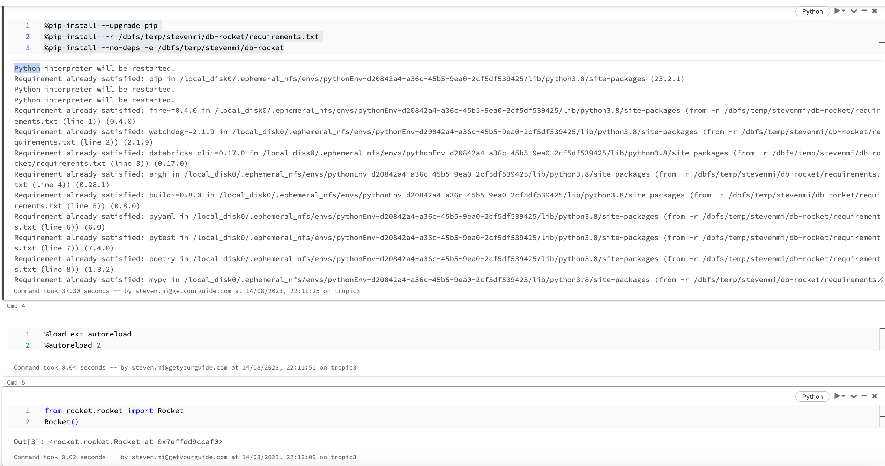

## Databricks-Rocket


[](https://badge.fury.io/py/databricks-rocket)


Databricks-Rocket (short db-rockets), keeps your local Python scripts installed and synchronized with a Databricks notebook. Every change on your local machine
is automatically reflected in the notebook. This shortens the feedback loop for developing git-based projects and
eliminates the need to set up a local development environment.

## Installation

Install `databricks-rocket` using pip:

```sh
pip install databricks-rocket
```

## Setup

Ensure you've created a personal access token in
Databricks ([offical documentation](https://docs.databricks.com/dev-tools/cli/index.html)). Afterward, set up the
Databricks CLI by executing:

```sh
databricks configure --token
```

Alternatively, you can set the Databricks token and host in your environment variables:

```sh
export DATABRICKS_HOST="mydatabrickshost"
export DATABRICKS_TOKEN="mydatabrickstoken"
```

If your project isn't already a pip package, you'll need to convert it into one. Use dbrocket for this:

```sh
rocket setup
```

Will create a setup.py for you.

## Usage

### To Sync Your Project

By default, `databricks-rocket` syncs your project to DBFS automatically. This allows you to update your code and have
those changes reflected in your Databricks notebook without restarting the Python kernel. Simply execute:

```sh
rocket launch
```

You'll then receive the exact command to run in your notebook. Example:

```sh
stevenmi@MacBook db-rocket % rocket launch --watch=False
>> Watch activated. Uploaded your project to databricks. Install your project in your databricks notebook by running:
>> %pip install --upgrade pip
>> %pip install  -r /dbfs/temp/stevenmi/db-rocket/requirements.txt
>> %pip install --no-deps -e /dbfs/temp/stevenmi/db-rocket

and following in a new Python cell:
>> %load_ext autoreload
>> %autoreload 2
```

Finally, add the content in you databricks notebook:


#### Include non-python files
Upload all root level json files:
```shell
rocket launch --glob_path="*,json"
```
On top also upload all env files:
```shell
rocket launch --glob_path="[\"*.json\", \".env*\"]"
```
When specifying lists, be mindful about the formatting of the parameter string.

### To Upload Your Python Package

If you've disabled the watch feature, `databricks-rocket` will only upload your project as a wheel to DBFS:

```sh
rocket launch --watch=False
```

Example:

```sh
stevenmi@MacBook db-rocket % rocket launch --watch=False
>> Watch is disabled. Building creating a python wheel from your project
>> Found setup.py. Building python library
>> Uploaded ./dist/databricks_rocket-2.0.0-py3-none-any.whl to dbfs:/temp/stevenmi/db-rocket/dist/databricks_rocket-2.0.0-py3-none-any.whl
>> Uploaded wheel to databricks. Install your library in your databricks notebook by running:
>> %pip install --upgrade pip
>> %pip install  /dbfs/temp/stevenmi/db-rocket/databricks_rocket-2.0.0-py3-none-any.whl --force-reinstall
```

## Blogposts

- [DBrocket 2.0](https://www.getyourguide.careers/posts/improving-data-science-productivity-with-db-rocket-2-0): A summary of the big improvements we made to the tool in the new release.
- [DB Rocket 1.0](https://www.getyourguide.careers/posts/open-sourcing-db-rocket-for-data-scientists) post also gives more details about the rationale around dbrocket.

## Support

- Databricks: >=7
- Python: >=3.7
- Tested on Platform: Linux, MacOs. Windows will probably not work but contributions are welcomed!
- Supports uploading to Unity Catalog Volumes starting from version 3.0.0. Note that the underlying dependency, `databricks-sdk`, is still in beta. We do not recommend using UC Volumes in production.

## Acknowledgments

- Thanks Leon Poli for the Logo :)
- Thanks Stephane Leonard for source-code and documentation improvements :)
- Thanks Malachi Soord for the CICD setup and README improvements

Contributions are welcomed!


# Security

For security issues please contact [security@getyourguide.com](mailto:security@getyourguide.com).

# Legal

db-rocket is licensed under the Apache License, Version 2.0. See [LICENSE](LICENSE.txt) for the full text.
